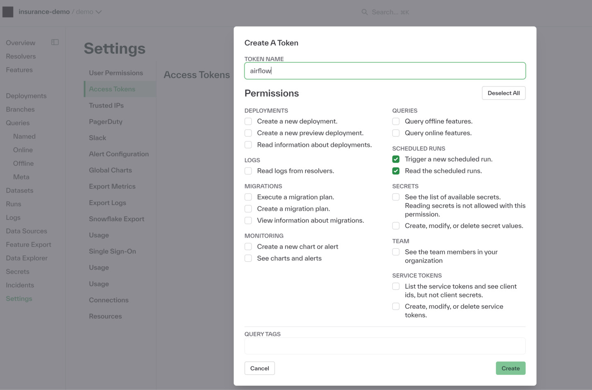

# Chalk Resolvers Can Be Triggered From Airflow

It's really easy to trigger a Chalk resolver as part of an airflow workflow: just add some environment
variables, the `chalkpy` python dependency, and create a new resolver task.

## Setup

To run a Chalk resolver in airflow, you'll need to add `CHALK_CLIENT_ID` and `CHALK_CLIENT_SECRET` and
`CHALK_ENVIRONMENT` environment variables to airflow.

If you want to create a specific access token for airflow, this can be done in the settings -> Access Tokens
page of the Chalk dashboard:


With this done, you'll be able to create a `ChalkClient` in an airflow task and trigger a resolver run.

The task can either use a shared python environment or an isolated python environment.

## Shared Python Environment

If you plan to use a shared python environment, you need to add the `chalkpy` package to your
set of airflow dependencies. Then you can simply define a task that triggers a resolver from
a `ChalkClient` and add it to your dag.

```python
from airflow.decorators import task
from chalk.client import ChalkClient
from airflow.exceptions import AirflowFailException


@task
def run_chalk_resolver() -> str:
    """
    Trigger the resolver.get_email_domain resolver
    """

    # This assumes that CHALK_CLIENT_SECRET, CHALK_CLIENT_ID, & CHALK_ENVIRONMENT environment variables
    # are passed to airflow.
    client = ChalkClient()

    result = client.trigger_resolver_run(
        "get_users"
    )
    if result.status == "failed":
        raise AirflowFailException(f"Resolver run failed: {result}")
    return result.id
```

## Isolated Python Environment

To isolate the chalkpy dependency from your python environment, you can use airflow's `@task.virtualenv` decorator.
Note, this is slightly slower since a python virtual environment is created for the task.

```python
from airflow.decorators import task
from airflow.exceptions import AirflowFailException


@task.virtualenv(
    task_id="virtualenv_python", requirements=["chalkpy"], system_site_packages=False
)
def run_chalk_resolver() -> str:
    """
    Trigger the resolver.get_email_domain resolver in a virtual environment
    """
    from chalk.client import ChalkClient

    # This assumes that CHALK_CLIENT_SECRET, CHALK_CLIENT_ID, & CHALK_ENVIRONMENT  environment variables
    # are passed to airflow.
    client = ChalkClient()

    result = client.trigger_resolver_run(
        "get_users"
    )
    if result.status == "failed":
        raise AirflowFailException(f"Resolver run failed: {result}")
    return result.id
```

## Polling the Resolver Run

To wait for the resolver run to complete in airflow, you can use the `get_run_status` Chalk method to poll the status
of the resolver run. One way to accomplish this is by using Airflow's Sensor framework.

```python
from airflow.decorators import task
from airflow.sensors.base import PokeReturnValue
from chalk.client import ChalkClient
from airflow.exceptions import AirflowFailException


@task.sensor(poke_interval=30, timeout=60 * 5)
def poll_resolver_run(run_id) -> PokeReturnValue:
    """
    Poll the running chalk resolver
    """
    # This assumes that CHALK_CLIENT_SECRET, CHALK_CLIENT_ID, & CHALK_ENVIRONMENT environment variables
    # are passed to airflow.
    client = ChalkClient()

    if (status := client.get_run_status(run_id).status) == 'succeeded':
        if status == "succeeded":
            return PokeReturnValue(True, run_id)
        elif status == "failed":
            raise AirflowFailException(f"Chalk resolver resolver run: {run_id}")
    return PokeReturnValue(False)
```

