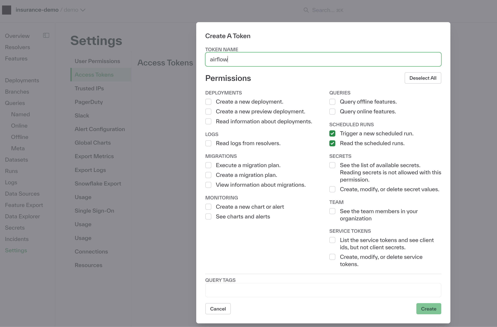

# Chalk Resolvers Can Be Triggered From Airflow

It's really easy to trigger a Chalk resolver as part of an airflow workflow: just add some environment
variables, the `chalkpy` python dependency, and create a new resolver task.

## Setup

To run a chalk resolver in airflow, you'll need to add `CHALK_CLIENT_ID` and `CHALK_CLIENT_SECRET` environment
variables to airflow. 

If you want to create a specific access token for airflow, this can be done in the settings -> Access Tokens 
page of the chalk dashboard:


With this done, you'll be able to create a ChalkClient instance in an  airflow task and trigger 
a resolver run.

The task can either use a shared python environment or an isolated python environment.

## Shared Python Environment

If you plan to use a shared python environment, you need to add the `chalkpy` package to your
set of airflow dependencies.

```python
from airflow.decorators import task
from chalk.client import ChalkClient

@task
def run_chalk_resolver():
    """
    Trigger the resolver.get_email_domain resolver in a virtual environment
    """

    # This assumes that CHALK_CLIENT_SECRET & CHALK_CLIENT_ID environment variables
    # are passed to airflow.
    client = ChalkClient()

    client.trigger_resolver_run(
        "resolver.get_email_domain"
    )
```

## Isolated Python Environment

To isolate the Chalk operator from your python environment, you can use airflow's `@task.virtualenv` decorator. Note,
this will be slightly slower since a python virtual environment will be created for each task.

```python
from airflow.decorators import task

@task.virtualenv(
    task_id="virtualenv_python", requirements=["chalkpy"], system_site_packages=False
)
def run_chalk_resolver():
    """
    Trigger the resolver.get_email_domain resolver in a virtual environment
    """
    from chalk.client import ChalkClient

    # This assumes that CHALK_CLIENT_SECRET & CHALK_CLIENT_ID environment variables
    # are passed to airflow.
    client = ChalkClient()

    client.trigger_resolver_run(
        "resolver.get_email_domain"
    )
```
